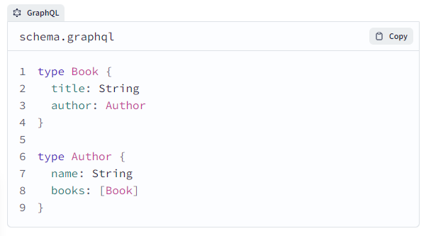
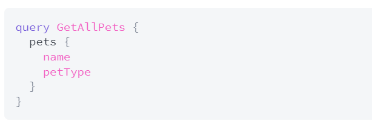
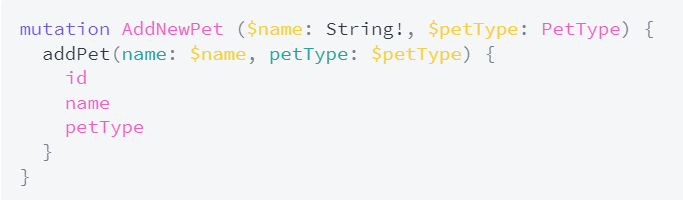
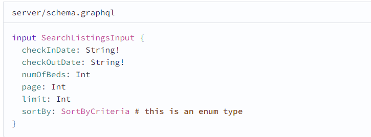
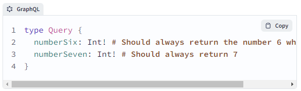
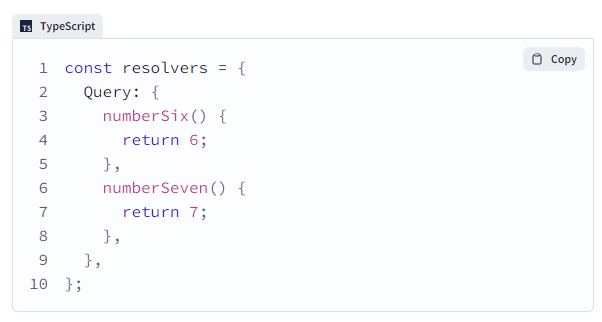

# GRAPHQL

## Índice
- [1. Definição](#1-definição)
- [2. Schemas e Types](#2-schemas-e-types)
- [3. Queries e Mutations](#3-queries-e-mutations)
- [4. Inputs](#4-inputs)
- [5. Resolvers](#5resolvers)

### 1. Definição
GraphQL significa Graph Query Language, e, como o nome sugere, é uma linguagem de query assim como SQL (Structured Query Language) porém seu uso não envolve implementar banco de dados, mas sim, definir dados seja para API ou servidor.
A linguagem oferece a habilidade de modelar dados usando schemas. O resultado disso é um paradigma muito parecido com o formato JSON.

### 2. Schemas e Types
O GraphQL usa um esquema para descrever a forma dos dados disponíveis. Este esquema define uma hierarquia de tipos com campos preenchidos a partir de seus armazenamentos de dados de back-end. O esquema também especifica exatamente quais consultas e mutações estão disponíveis para execução pelos clientes.
O modelo de dados no GraphQL é representado em tipos, que são fortemente tipados (typed). Deve haver um mapeamento one-to-one entre os modelos e os codigos do GraphQL. Pense nisso como uma tabela de banco de dados em que a tabela do usuário tenha campos como id, primeiro nome, sobrenome, e-mail, projetos. **Coisas que valem a pena lembrar:** o ponto de exclamação que indica que um identificador (id) não pode ser anulável ou, em outras palavras, é preciso ter algo no identificador por ser um campo obrigatório. 

Aqui está um pequeno exemplo de esquema que define dois tipos de objeto: Book e Author:

Um esquema define uma coleção de tipos e os relacionamentos entre esses tipos. No esquema de exemplo acima, o tipo Book pode ter um associado Author e um Author pode ter uma lista de books.

### 3. Queries e Mutations
 As queries definem quais consultas você pode executar seu GraphQL API. Por convenção, deve haver um **RootQuery**, que contém todas as consultas existentes. Já as mutations são usadas para criar, alterar ou deletar dados do banco de dados.

Uma query para buscar todos os animais de estimação de um aplicativo pode ser assim:

E então uma mutation que adiciona um novo animal de estimação pode ser mais ou menos assim:

### 4. Inputs
O input type em um schema GraphQL é um tipo de objeto especial que agrupa um conjunto de argumentos e pode então ser usado como argumento para outro campo .
Usar input type  nos ajuda a agrupar e entender argumentos , especialmente para mutations . Por exemplo, ao criar um anúncio no Airlock, sabemos que a operação precisa incluir vários dados sobre o anúncio (título, descrição, miniatura da foto, número de camas, custo por noite, tipo de localização e comodidades). Poderíamos listar todos os argumentos dentro da mutation createListing, mas isso pode ser complicado e difícil de entender.
Em vez disso, podemos criar um tipo de entrada chamado CreateListingInput e listar todos os campos necessários lá. Dessa forma, podemos manter a definição de mutação clara e também podemos reutilizar esse tipo de entrada em outras mutações que requerem o mesmo conjunto de argumentos .

#### Definindo um input
Para definir um input type, use a palavra-chave input seguida do nome e chaves ( {}). Dentro das chaves, listamos os campos e tipos como de costume. Observe que os campos de um input podem ser apenas escalares , enum ou outro tipo de entrada.

Aqui está um exemplo de input type do schema Airlock :

Note que a palavra-chave é input e não type. Imagine que ele seja um formulário em uma página em que você precisa preencher alguns dados e quais os tipos de informações necessários para criar um perfil de usuário.

### 5.Resolvers
Como o próprio nome sugere, a função resolver dá um conjunto específico de instruções para converter as operações do GraphQL em dados. Ele é basicamente uma função de controle, a lógica do que tem que ser retornado (resolvers for queries) quando essa consulta é feita e o usuário solicita os dados, já os resolvers para mudanças de conteúdo (resolvers for mutations) são utilizadas quando o usuário busca atualizar ou deletar os dados.

#### Sintaxe Básica
Digamos que nosso servidor defina o seguinte schema:

Queremos definir resolvers para os campos numberSix e numberSeven da query root type para que eles sempre retornem 6 e 7 quando forem consultados.

Essas definições do resolver são:

##### Fontes:
- https://medium.com/@emerson_pereira/introdu%C3%A7%C3%A3o-a-graphql-cbd1697784bf
- https://graphql.org/learn/
- https://www.apollographql.com/blog/graphql/basics/mutation-vs-query-when-to-use-graphql-mutation/
- https://www.apollographql.com/tutorials/side-quest-intermediate-schema-design/01-introduction
- https://www.hostinger.com.br/blog/graphql-vs-rest-qual-o-melhor-para-o-desenvolvimento-de-api/
- https://www.apollographql.com/docs/apollo-server/data/resolvers/

##### Tutorial:
- https://www.youtube.com/watch?v=5199E50O7SI

##### Para abrir a porta 400:
- nodemon index